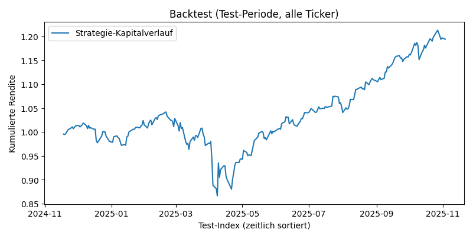
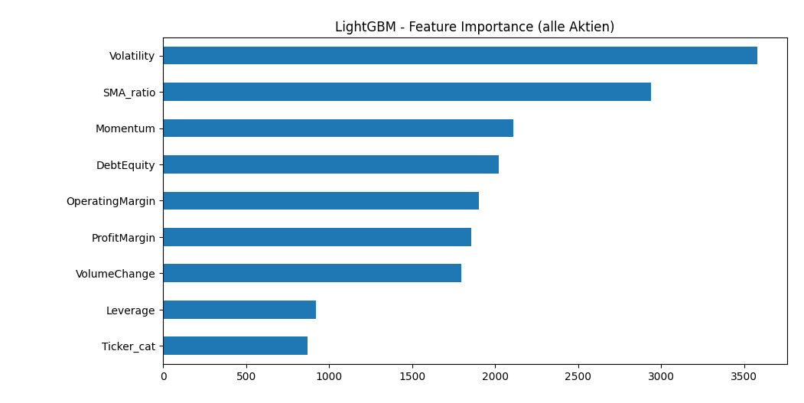

# Up/Down Aktienklassifikation

## Überblick

Dieses Projekt trainiert ein binäres Klassifikationsmodell (LightGBM), das für mehrere Aktien prognostiziert, ob der Kurs in den zuvor definiterten nächsten Tagen steigen (`Target = 1`) oder fallen bzw. nicht steigen (`Target = 0`) wird. Neben Kursdaten werden grundlegende Fundamentaldaten (Bilanz und GuV) pro Unternehmen einbezogen. Dieses Modell speichert am Ende die Ergebnisse, mit welcher Wahrscheinlichkeit Aktien in `TARGET_HORIZON_DAYS`-Tagen steigen werden, in einer JSON-Datei ab. 

Das Skript **up_down_evalutation_all_v0.11.py** führt den kompletten Workflow aus:

1. Einlesen und Aufbereiten der Kursdaten
2. Einlesen und Verknüpfen der Fundamentaldaten pro Ticker
3. Feature Engineering (technische und fundamentale Kennzahlen)
4. Zeitbasierter Train/Test-Split
5. Training eines LightGBM-Klassifikators
6. Auswertung mit Klassifikationsreport, ROC-AUC, weiteren Metriken
7. Mini-Backtest einer Long-Strategie
8. Ausgabe aktueller Up/Down-Einschätzungen als JSON

---

## Installation und Ausführung

### Voraussetzungen
- Python 3.x
- Empfohlene Pakete (z. B. via pip install):
```
pip install pandas numpy lightgbm scikit-learn matplotlib
```

### Skript starten
Im Projektverzeichnis:
```
python3 up_down_evalutation_all_v0.11.py
```

Voraussetzung: Die `data/prices` und `data/fundamentals`-Verzeichnisse sind korrekt befüllt und `TICKER_MAP` passt zu den vorhandenen Dateien.

---

## Verzeichnisstruktur

Standardmäßig erwartet das Skript folgende Struktur (relativ zum Skript):
```
data/
  prices/
    AAPL_US.csv
    MSFT_US.csv
    ...
  fundamentals/
    AAPL_balance_sheet.csv
    AAPL_income_statement.csv
    ...
```
`data/prices`:
Enthält tägliche Kursdaten pro Ticker (STOOQ-API verwendet) mit mindestens den Spalten:

- Date, Open, High, Low, Close, Volume

`data/fundamentals`:
Enthält jeweils zwei Dateien pro Unternehmen (Alphavantage-API verwendet):
<TICKER>_balance_sheet.csv
<TICKER>_income_statement.csv

Die Zuordnung zwischen Kursdaten-Ticker und Fundamentals-Basisnamen erfolgt über das Dictionary TICKER_MAP im Skript, zum Beispiel:
```
TICKER_MAP = {
    "AAPL": "AAPL",
    "MSFT": "MSFT",
    "SAP": "SAP.DE",
    ...
}
```

Nur Ticker, die im Mapping vorhanden sind und für die alle benötigten Dateien existieren, werden in das Training einbezogen.

---

## Globale Parameter

| Parameter                      | Bedeutung                    |
| ------------------------------ | ---------------------------- |
| TARGET_HORIZON_DAYS            | Vorhersagehorizont           |
| TEST_SPLIT_RATIO               | Anteil Test-Set              |
| PROBA_THRESHOLD                | Schwelle für Long-Signale    |
| VOLATILITY / MOMENTUM / VOLUME | Fenstergrößen für Features   |
| VARIANTE                       | Steuerung der Backtest-Logik |

Variante:
1. Position wird für eine feste Anzahl Tage (`TARGET_HORIZON_DAYS`) gehalten.
2. Position wird mindestens `TARGET_HORIZON_DAYS` gehalten und dann so lange, wie das Signal Long bleibt.

---

## Feature Engineering

### Kursbasierte Features (build_price_features)

- `Return_1d`: Tagesrendite (prozentual)
- `Return_fwd`: Rendite vom heutigen Close zum Close in TARGET_HORIZON_DAYS Tagen
- `Target`: Binäres Label, ob Return_fwd > 0 ist (1) oder nicht (0)
- `SMA10`, `SMA50`: Gleitende Durchschnitte der Schlusskurse
- `SMA_ratio`: Verhältnis SMA10 / SMA50 (Trenderkennung)
- `Volatility`: Rolling Standardabweichung der täglichen Renditen über VOLATILITY Tage
- `Momentum`: Close[today] / Close[today - MOMENTUM] - 1
- `VolumeChange`: prozentuale Volumenveränderung über VOLUME Tage

### Fundamentale Features (load_fundamentals_for_ticker)

Aus Bilanz und GuV werden unter anderem abgeleitet:

- `DebtEquity`: Verschuldungsgrad = Verbindlichkeiten / Eigenkapital
- `Leverage`: Hebel = Gesamtvermögen / Eigenkapital
- `ProfitMargin`: Nettomarge = Nettoergebnis / Umsatz
- `OperatingMargin`: operative Marge = Operating Income / Umsatz

Die Daten werden zeitlich über `merge_asof` an die Kursdaten gemappt, so dass zu jedem Handelstag der zuletzt bekannte Quartalsbericht zugeordnet wird. 

---

## Modell Features

Für das Modell werden folgende Features verwendet:
```
FEATURE_COLUMNS = [
    "SMA_ratio",
    "Volatility",
    "Momentum",
    "VolumeChange",
    "DebtEquity",
    "Leverage",
    "ProfitMargin",
    "OperatingMargin",
]

# Ticker als kategorialer Code
full_panel["Ticker_cat"] = full_panel["Ticker"].astype("category").cat.codes

FEATURE_COLUMNS_WITH_TICKER = FEATURE_COLUMNS + ["Ticker_cat"]
```

---

## Trainingsprozess

1. Datenzusammenführung
    Alle Ticker werden in full_panel untereinander konkateniert.
2. Bereinigung
    Zeilen mit fehlenden Werten in den Modellfeatures, Target, Return und Datum werden entfernt.
3. Zeitbasierter Split
    Über time_based_train_test_split wird das DataFrame nach Datum sortiert und in Train und Test gesplittet, wobei das Test-Set am Ende der Zeitreihe liegt (realistisch für Zeitreihen).
4. Modell
  Es wird ein LGBMClassifier mit festen Hyperparametern trainiert:
    ```
    clf = LGBMClassifier(
        n_estimators=600,
        learning_rate=0.05,
        max_depth=6,
        subsample=0.8,
        colsample_bytree=0.8,
        random_state=42,
    )
    ```
5. Evaluierung
    In evaluate_model wird das Modell anhand verschiedener Metriken auf dem Test-Set ausgewertet, anschließend erfolgt ein Mini-Backtest, und es wird eine mögliche Gesamtrendite bei Verwendung des Up/Down-Schwellwerts für den Testzeitraum berechnet.

---

## Ausgaben des Skripts

Beim Durchlauf werden u. a. folgende Ergebnisse erzeugt:

- Klassifikationsreport:

  ```
  Klassifikationsreport_YYYYMMDD_HHMMSS.txt
  Beispiel:
  === Klassifikationsreport (Test) ===
              precision    recall  f1-score   support

           0      0.500     0.189     0.274      3782
           1      0.558     0.844     0.672      4590

    accuracy                          0.548      8372
    macro avg     0.529     0.517     0.473      8372
    weighted avg  0.532     0.548     0.492      8372

    ROC-AUC: 0.528
    Accuracy : 0.548
    Precision: 0.558
    Recall   : 0.844
  ```

- Feature Importances (Konsole und angehängt am Klassifikationsreport):

  ```
  Wichtigkeit der einzelnen Parametern für das globale Modell.
  Beispiel: 
  === Feature Importances (globales Modell) ===
  Volatility         3579
  SMA_ratio          2939
  Momentum           2109
  DebtEquity         2022
  OperatingMargin    1904
  ProfitMargin       1855
  VolumeChange       1795
  Leverage            919
  Ticker_cat          872
  dtype: int32
  ```

- Ergebnisse der Modellvorhersage - results.json:

  ```
  JSON Datei mit aktuellen Signalen pro Ticker (letzter Handelstag):
  [
    {
      "Ticker": "AAPL",
      "Date": "2025-11-18",
      "ProbUp": 0.63,
      "Signal": "UP"
    },
    ...
  ]
  ```

- Plots (Matplotlib):

      Kapitalverlauf der Strategie im Testzeitraum:

    

    Balkendiagramm der Feature Importances

    

---

## Analyse des Klassifikationsreports

```
=== Klassifikationsreport (Test) ===    
              precision    recall  f1-score   support

           0      0.500     0.189     0.274      3782
           1      0.558     0.844     0.672      4590

    accuracy                          0.548      8372
   macro avg      0.529     0.517     0.473      8372
weighted avg      0.532     0.548     0.492      8372

ROC-AUC: 0.528
Accuracy : 0.548
Precision: 0.558
Recall   : 0.844
```

### Zentrale Beobachtungen:

- Klassenverteilung:
Es gibt 3782 Samples der Klasse 0 (nicht steigen) und 4590 Samples der Klasse 1 (steigen). Das entspricht einem leichten Übergewicht der positiven Klasse (ungefähr 54.8 % Klasse 1).

- Accuracy (0.548):
Die Gesamtgenauigkeit liegt bei 54.8 %.
Das ist praktisch identisch mit einer trivialen Strategie, die immer die Mehrheitsklasse (hier: Klasse 1) vorhersagt, da der Anteil der Klasse 1 in den Daten ebenfalls ca. 54.8 % beträgt. Das Modell schlägt den naiven Mehrheitsklassen-Baseline also kaum.

- ROC-AUC (0.528): 
Der ROC-AUC Wert liegt nur knapp über 0.5, dem Niveau eines zufälligen Klassifikators.
Das deutet darauf hin, dass die Modellprognosen nur eine sehr schwache Trennschärfe zwischen steigenden und nicht steigenden Tagen haben.

#### Leistung für Klasse 1 (steigen):

- Precision: 0.558 - 
Etwa 56 % der als „steigen“ vorhergesagten Fälle sind tatsächlich gestiegen.

- Recall: 0.844 - 
Das Modell erkennt einen Großteil der tatsächlich steigenden Fälle. → Das Modell ist stark darauf ausgerichtet, möglichst viele „UP“-Fälle zu erwischen, nimmt dafür aber viele Fehlalarme in Kauf.

#### Leistung für Klasse 0 (nicht steigen):

- Precision: 0.500 - 50 % der als nicht steigen vorhergesagten Fälle sind tatsächlich nicht gestiegen.

- Recall: 0.189 - Die Klasse 0 wird sehr schlecht erkannt.
Viele Tage, die eigentlich nicht steigen, werden trotzdem als „steigen“ klassifiziert.

#### Interpretation im Trading-Kontext:

- Das Modell produziert viele „UP“-Signale mit relativ niedriger Präzision.

- Die hohe Trefferquote für steigende Tage (Recall Klasse 1) klingt attraktiv, aber durch die schlechte Unterscheidung gegenüber nicht steigenden Tagen (schwache ROC-AUC) ist die Qualität der Signale fragwürdig.

- Für eine Trading-Strategie ist nicht nur wichtig, ob der Kurs irgendwie steigt, sondern ob die Signale nach Kosten, Slippage und Risiko noch eine ausreichend positive Erwartung liefern.
Diese Frage kann man erst über den Backtest und zusätzliche KPIs (Sharpe, Drawdown etc.) beantworten.

---

## Kritische Auseinandersetzung & Limitationen

1. Nahezu keine Verbesserung gegenüber der Mehrheitsklasse

        Die Accuracy entspricht praktisch der Mehrheitsklassenrate.

        ROC-AUC von 0.528 zeigt, dass das Modell nur minimal besser als Zufall ist.

        Das spricht dafür, dass die aktuellen Features und Hyperparameter die Struktur im Datensatz kaum erfassen.

2. Ungleichgewicht in der Klassifikationsleistung

        Klasse 0 wird schlecht erkannt (Recall 0.189).
        In der Praxis bedeutet das: viele Tage ohne signifikanten Anstieg werden trotzdem als Kaufsignal interpretiert.

        Für eine Strategie, die nur Long geht, kann das zu zu vielen Trades, hoher Turnover und starken Transaktionskosten führen.

3. Label-Definition und Vorhersagehorizont

        Das Target ist ein reines Binärziel: „Kurs in 5 Tagen höher als heute, ja oder nein“.

        Diese Definition ignoriert:
          Die Stärke des Anstiegs oder Rückgangs
          Volatilität und Risiko
          Kosten und Spreads

        Möglicherweise ist die 5-Tages-Horizontwahl zu kurz oder zu stark von Rauschen dominiert.

4. Datenbasis und Ticker-Auswahl

        Derzeit werden nur die im TICKER_MAP hinterlegten großen Titel genutzt.

        Es ist nicht klar, wie breit der Zeitraum der Daten ist und wie stabil die Beziehungen über verschiedene Marktphasen sind (Bullenmarkt, Krisen etc.).

        Fundamentaldaten liegen meist quartalsweise vor, Kursdaten täglich. Die merge_asof Logik ist sinnvoll, kann aber bei lückenhaften Reports zu vielen NaN und damit entfernten Zeilen führen.

5. Modellierung und Hyperparameter

        LightGBM wird mit fixen Hyperparametern trainiert, ohne systematische Hyperparameter- oder Modellselektion.

        Es findet keine Zeitreihen-Crossvalidation statt, sondern nur ein einfacher Train/Test-Split.

        Mögliche Overfitting- oder Underfitting-Probleme werden nicht explizit überprüft (keine Lernkurven, keine Validierungsmetriken über mehrere Splits).

6. Backtest Limitierungen

        Im Skript ist ein Mini-Backtest implementiert, der:
          Pro Ticker eine Position eingeht, wenn proba_up > PROBA_THRESHOLD
          Die Position je nach VARIANTE unterschiedlich lange hält

        Einschränkungen:
          Keine Transaktionskosten oder Slippage berücksichtigt
          Keine Begrenzung der Positionsgröße oder Risiko-Management (z. B. Stop-Loss)
          Kein Vergleich mit Benchmarks (Buy-and-Hold, Equal-Weight Portfolio etc.)
          Potenzielles Lookahead-Risiko muss sorgfältig überprüft werden (derzeit scheint der zeitliche Split ok, aber tieferer Audit wäre sinnvoll).

7. Fokus auf US-Aktien

        Der überwiegende Teil der aktuell verwendeten Wertpapiere im Modell besteht aus US-Aktien. Dadurch entsteht eine geografische und marktstrukturelle Verzerrung:

          US-Aktien haben andere Liquiditätsmuster, Handelszeiten und Regulierung als europäische oder asiatische Titel.
          Fundamentaldaten sind in den USA deutlich standardisierter und besser verfügbar, was das Modell begünstigt.
          Modelle, die überwiegend auf US-Titeln trainiert werden, generalisieren möglicherweise nicht zuverlässig auf internationale Märkte.
          Branchendominanz (Tech, Large Caps, Growth-Titel) kann dazu führen, dass das Modell Muster lernt, die außerhalb der USA nicht gelten.
          Eine breitere geografische Diversifikation (EU, Japan, Emerging Markets) wäre notwendig, um ein robusteres, global anwendbares Modell aufzubauen.

---

## Verbesserungsmöglichkeiten 

1. Mehr Aktien und Fundamentalkennzahlen einbeziehen

        Den Tickerraum in TICKER_MAP erweitern (weitere Branchen, Mid Caps, internationale Titel).

        Zusätzliche Fundamentalkennzahlen aus Bilanz und GuV nutzen, z. B.:
          Cashflow-Kennzahlen (operativer Cashflow, Free Cashflow)
          Wachstumsraten (Umsatzwachstum, Gewinnwachstum)
          Bewertungskennzahlen (KGV, KUV, KBV, EV/EBITDA, sofern verfügbar)

        Ziel: breitere Datenbasis für das Training und potenziell robustere Muster.

2. Bessere und mehr Modelldaten aus vorhandenen Quellen extrahieren

        Feature Engineering erweitern:
          Weitere technische Indikatoren (RSI, MACD, Bollinger Bänder etc.)
          Regime-Indikatoren (z. B. Marktrendite, VIX, Zinsniveau als externe Features)
          Relative Stärke gegenüber einem Index oder Sektor-ETF

        Zeitliche Aggregation / Lag-Features:
          Mehrere verzögerte Werte von Momentum, Volatility, VolumeChange
          Rolling Min/Max, Quantile, Drawdown Features

        Qualitätskontrolle der Fundamentals:
          Ggf. fehlende Quartalswerte mittels Vorwärtsfüllen (forward fill), sofern betriebswirtschaftlich sinnvoll
          Zusätzlich: Flags für „fehlende Daten“ als separate Binärfeatures.

3. Branchen-spezifische Modelle

        Überprüfen, ob die Klassifikationsleistung besser wird, wenn man nur Aktien derselben Branche verwendet.

          Schritt 1: Branchen-Zuordnung pro Ticker hinterlegen (Tech, Financials, Energy, Healthcare etc.).
          Schritt 2: Für jede Branche separat ein Modell trainieren.
          Schritt 3: Klassifikationsreports (Accuracy, ROC-AUC etc.) je Branche und gegen Gesamtmodell vergleichen.

        Hypothese:
          Aktien innerhalb einer Branche reagieren ähnlicher auf fundamentale und technische Signale.
          Ein branchenspezifisches Modell kann so zuverlässiger werden, als ein globales Modell über alle Sektoren.

4. Alternative Modelle testen

        Neben LightGBM können andere Modellklassen ausprobiert werden:
          Baumbasierte Modelle:
            Random Forest
            XGBoost, CatBoost

          Lineare Modelle:
            Logistische Regression mit Regularisierung
            Lineare SVM

          Zeitreihen-Modelle / Deep Learning (langfristig):
            1D-CNNs oder LSTMs/GRUs auf Sequenzen
            Transformer-basierte Zeitreihenmodelle

        Wichtige Ergänzung dazu:
        Systematische Hyperparameteroptimierung (z. B. mit Optuna oder Grid/Random Search) sowie Zeitreihen-Crossvalidation (Walk Forward Validation) verwenden.

5. Zieldefinition und Schwellenwerte verfeinern

        Unterschiedliche Zieldefinitionen testen:
          Nur „starke“ Anstiege als positiv labeln (z. B. Return_fwd > 2 %).
          Multiklassen-Labels (stark fallen, moderat, stark steigen).

        Threshold Tuning:
          Anstatt fixer Schwelle (0.55) eine Precision-Recall-Kurve analysieren.
          Schwelle so wählen, dass eine attraktive Balance zwischen Trefferquote und Anzahl an Trades entsteht.

6. Robustere Evaluierung und Backtests

        Zusätzliche Metriken:
          Confusion Matrix, Precision-Recall AUC, Matthews Correlation Coefficient.

        Zeitreihen-CV:
          Mehrere zeitliche Splits (Rollende Fenster) helfen zu sehen, ob das Modell nur in einem Zeitraum „glücklicherweise“ funktioniert.

        Trading-spezifische Metriken im Backtest:
          Sharpe Ratio, Max Drawdown, Hit Ratio, durchschnittlicher Tradegewinn.

        Einbezug plausibler Transaktionskosten und Slippage.

(Für die Ideensuche, Hilfestellungen bei der Modellauswahl inkl. Mini-Backtest, Datenaufbereitung und finales Strukturieren und Überarbeiten des Codes, sowie für das Aufsetzen, Strukturieren und Ausformulieren des README habe ich ChatGPT - Modell GPT-5.1, November 2025 verwendet)


